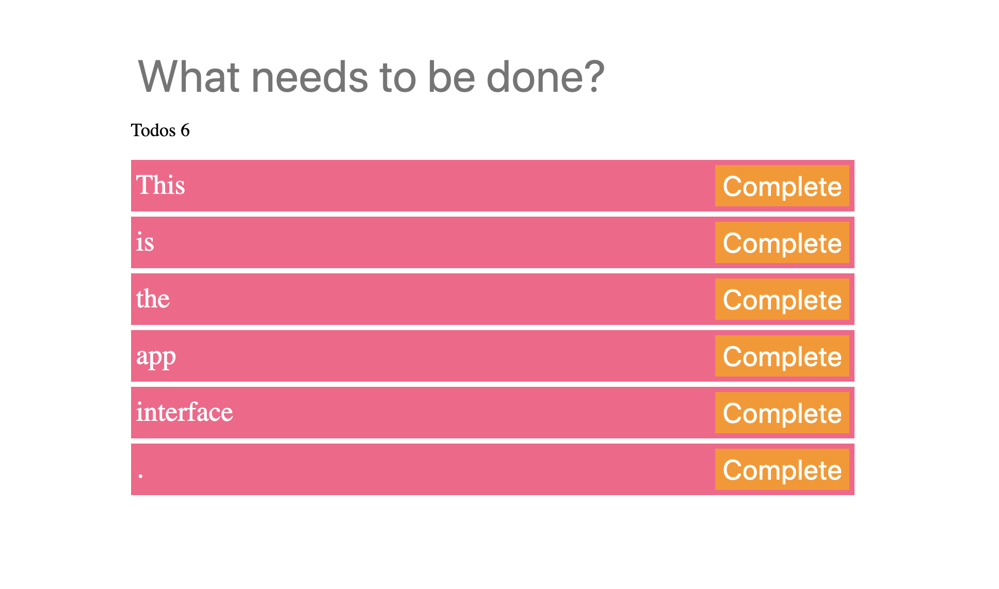

# Todo Manager

Author: Ernesto Rodriguez

## Summary

**This app was a class activity from the Full-Stack-Flex course at UM.** It uses client-side-storage to save your todos, this lets you close the app on your browser and when you open it back up (in the same browser) all your previous changes will be untouched.

## User Interface

## Deployed App
You can find the deployed app [here](https://erodrigueztoimil.github.io/todo_manager/)
